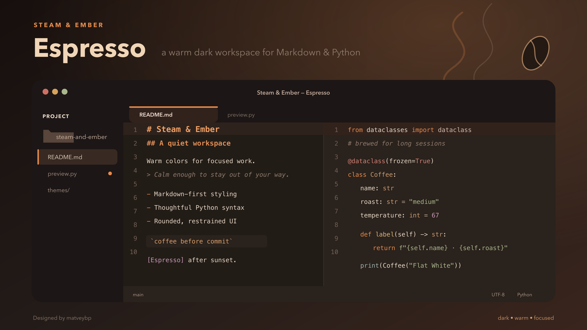
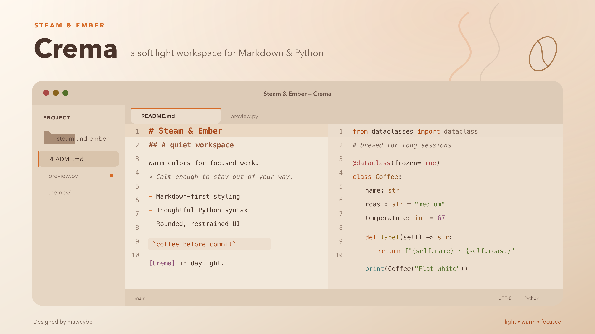
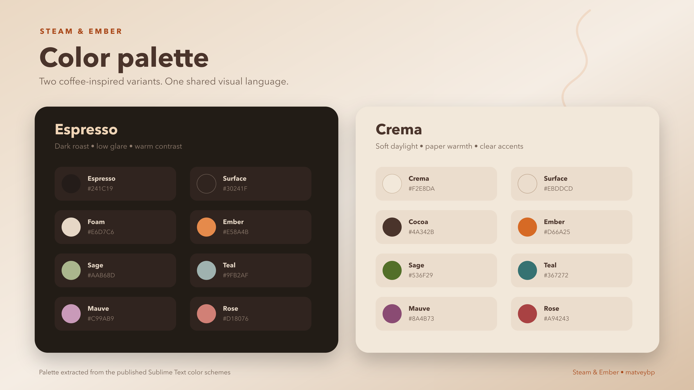

# Steam & Ember

A calm, coffee-inspired theme and color scheme for Sublime Text 4.

Steam & Ember combines warm brown surfaces, crema neutrals, and restrained ember-orange accents. It includes two coordinated variants designed for comfortable work throughout the day:

- **Espresso** — a dark, low-glare theme with warm highlights.
- **Crema** — a soft light theme with balanced, colorful syntax accents.

> **Project status:** active development · current version `0.3.0`.
> Steam & Ember is designed for Sublime Text 4 on macOS, Windows, and Linux. It is currently tested on Sublime Text 4, build 4200, on macOS. Exact title-bar rendering may vary by operating system.

## Preview

| Espresso | Crema |
|---|---|
|  |  |

### Color Palette



## Features

- Matching UI themes and editor color schemes.
- Dark Espresso and light Crema variants.
- Warm coffee-inspired surfaces without excessive yellow tones.
- Restrained ember-orange interface accents.
- Rounded tabs using native Sublime Text resources.
- Clearly highlighted active tabs and modified files.
- Medium contrast designed for long reading and editing sessions.
- Carefully styled Markdown headings, links, quotes, and code blocks.
- Distinct colors for Python keywords, strings, types, numbers, functions, classes, and decorators.


## Variants

| Variant | Appearance | Character |
|---|---|---|
| Espresso | Dark | Deep brown surfaces with warm orange highlights |
| Crema | Light | Soft beige surfaces with balanced colorful accents |

Both variants include a UI theme and a matching color scheme.

## Included Files

| File | Purpose |
|---|---|
| `Steam & Ember Espresso.sublime-theme` | Dark Sublime Text interface |
| `Steam & Ember Espresso.sublime-color-scheme` | Dark editor and syntax colors |
| `Steam & Ember Crema.sublime-theme` | Light Sublime Text interface |
| `Steam & Ember Crema.sublime-color-scheme` | Light editor and syntax colors |
| `Preferences.sublime-settings.example` | Example configuration with automatic theme switching |
| `samples/` | Markdown and Python files used for visual testing |

## Installation

### Manual Installation

1. Download the [latest Steam & Ember release](https://github.com/matveybp/steam-and-ember/releases/latest) archive from GitHub.
2. Extract the downloaded archive.
3. Make sure the extracted folder is named `Steam & Ember`.
4. Open the Command Palette in Sublime Text:
   - macOS: `⌘ ⇧ P`
   - Windows/Linux: `Ctrl + Shift + P`
5. Run `Preferences: Browse Packages`.
6. Move the entire `Steam & Ember` folder into the directory that opens.

The resulting structure should look like this:

```text
Packages/
├── User/
└── Steam & Ember/
    ├── Steam & Ember Espresso.sublime-theme
    ├── Steam & Ember Espresso.sublime-color-scheme
    ├── Steam & Ember Crema.sublime-theme
    └── Steam & Ember Crema.sublime-color-scheme
```

The `Steam & Ember` folder should be placed next to `User`, not inside it.

Sublime Text normally detects the theme automatically. If it does not appear immediately, restart the editor.


## Configuration

### Selecting a variant

Open the Command Palette and run:

1. `UI: Select Theme`
2. Select either:
   - `Steam & Ember Espresso`
   - `Steam & Ember Crema`
3. Run `UI: Select Color Scheme`.
4. Select the color scheme matching your chosen theme.

Use matching theme and color scheme variants for the intended appearance:

| Variant  | Theme                    | Color Scheme             |
| -------- | ------------------------ | ------------------------ |
| Espresso | `Steam & Ember Espresso` | `Steam & Ember Espresso` |
| Crema    | `Steam & Ember Crema`    | `Steam & Ember Crema`    |

> [!TIP]
> Feel free to mix the Espresso and Crema themes and color schemes—you may discover a coffee blend you prefer.

### Automatic Dark and Light Switching

To follow your operating system’s appearance, open `Preferences: Settings` from the Command Palette and add the following properties to your user settings:

```json
{
    "theme": "auto",
    "dark_theme": "Steam & Ember Espresso.sublime-theme",
    "light_theme": "Steam & Ember Crema.sublime-theme",

    "color_scheme": "auto",
    "dark_color_scheme": "Steam & Ember Espresso.sublime-color-scheme",
    "light_color_scheme": "Steam & Ember Crema.sublime-color-scheme"
}
```

Do not replace your entire settings file if it already contains personal preferences. Add or update only the relevant properties.

### Optional UI Settings

Recommended settings if you want to experience Steam & Ember as it was intended.

```json
{
    "file_tab_style": "rounded",
    "highlight_modified_tabs": true,
    "font_size": 15,
    "line_padding_top": 2,
    "line_padding_bottom": 2,
    "highlight_line": true,
    "highlight_gutter": true,
    "caret_style": "smooth",
    "draw_minimap_border": false
}
```

> The preview images use Menlo. Steam & Ember itself does not require a specific font. You can use this font by adding `"font_face": "Menlo"` to the settings file.

## Syntax Support

Steam & Ember uses standard Sublime Text scopes and should work with most built-in syntaxes.

The current release has been tested most extensively with:

- Markdown
- Python
- JSON
- Sublime Text settings and theme files

Support for additional languages will be refined as the project develops.

## Compatibility

Currently tested with:

- Sublime Text 4, build 4200
- macOS

The theme may also work on Windows and Linux, but those platforms have not yet been tested. Feedback and screenshots from other systems are welcome.

## Project Status

Steam & Ember is currently in active development. Colors, interface details, filenames, and package structure may still change before `v1.0.0`.

The current `v0.3` update focuses primarily on Crema:

- brighter syntax accents;
- improved separation between token types;
- stronger active interface elements;
- preserved soft beige surfaces and subtle code-block backgrounds.

## Roadmap

- Test both variants during longer work sessions.
- Improve support for additional programming languages.
- Test the theme on Windows and Linux.
- Finalize the repository structure.
- Prepare the package for Package Control.
- Publish the first stable `v1.0.0` release.

## Feedback

If you find an inconsistent color, unreadable syntax element, or interface issue, please open a GitHub Issue.

When reporting a visual problem, include:

- your operating system;
- Sublime Text version;
- active Steam & Ember variant;
- syntax or file type;
- a screenshot when possible.

## Contributing

Suggestions, bug reports, and small improvements are welcome while the project is in development.

For larger changes, please open an Issue first so the proposed direction can be discussed before implementation.

## License

Steam & Ember is released under the [MIT License](LICENSE).

Copyright © 2026 [matveybp](https://github.com/matveybp).

## Author

Created and maintained by [matveybp](https://github.com/matveybp).

Steam & Ember began as a personal Sublime Text setup inspired by espresso, flat whites, warm interiors, and calm creative workspaces.
